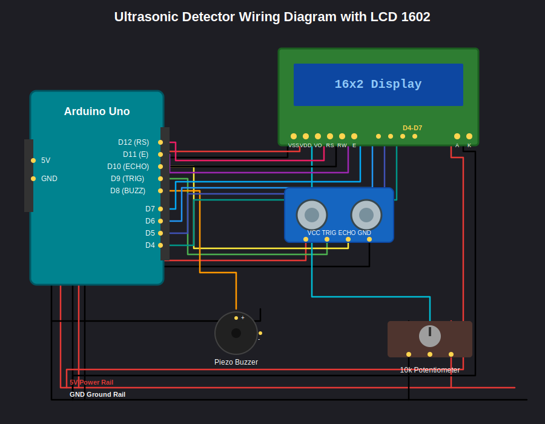

# 📡 Arduino Ultrasonic Distance Detector with LCD 1602 & Buzzer

A real-time embedded system project built using **Arduino Uno**, **HC-SR04 ultrasonic sensor**, **16x2 LCD display**, and a **piezo buzzer**.

This project measures distance using sound waves and provides:
- 📟 Visual feedback on LCD
- 🔊 Audio alerts with buzzer
- 💻 Serial Monitor debugging output

It is commonly used for:
- 🚗 Parking sensors
- 🤖 Obstacle-avoidance robots
- 📏 Distance measurement systems
- 🎓 Embedded systems learning

---

## 📋 Features

- Real-time distance measurement (2 cm – 400 cm)
- LCD 1602 live display output
- Buzzer alerts with distance-based frequency changes
- Serial Monitor debugging support
- Timeout protection against invalid readings
- Stable and beginner-friendly Arduino code
- Easy to expand for robotics or IoT projects

---

## 🧠 How It Works

The HC-SR04 sensor emits ultrasonic waves (~40 kHz). These waves reflect from objects and return to the sensor. Arduino measures the time delay and calculates distance.

### 📐 Distance Formula

d = (v × t) / 2

Where:
- d = distance to object  
- v = speed of sound (~343 m/s)  
- t = time for echo return  

The division by 2 is required because the signal travels:
sensor → object → sensor

---

## ⚙️ System Architecture

HC-SR04 → Arduino Uno → Output Layer
- LCD 1602 Display
- Piezo Buzzer
- Serial Monitor

---

## 🛠 Hardware Requirements

- Arduino Uno ×1  
- HC-SR04 Ultrasonic Sensor ×1  
- LCD 1602 Display ×1  
- Piezo Buzzer ×1  
- 10kΩ Potentiometer ×1  
- Breadboard ×1  
- Jumper Wires  
- USB Cable ×1  

---

## 🔌 Wiring Diagram

## Arduino Code
Use the code in file to get started:
`
ardyino_ultra-dist-sensor.ino
`
### HC-SR04

VCC → 5V  
GND → GND  
TRIG → D9  
ECHO → D10  

---

### Buzzer

+ → D3  
- → GND  

---

### LCD 1602 (Parallel Mode)

RS → D12  
E  → D11  
D4 → D7  
D5 → D6  
D6 → D5  
D7 → D4  
RW → GND  
VSS → GND  
VDD → 5V  
VO → Potentiometer middle pin  
LED+ → 5V  
LED- → GND  

---

### Potentiometer

Left → GND  
Middle → VO (LCD contrast)  
Right → 5V  

---

## 🔊 Buzzer Behavior

< 10 cm  → Fast beep ⚠️  
10–20 cm → Medium beep  
20–50 cm → Slow beep  
> 50 cm  → Silent  

---

## 📟 LCD Output Examples

Distance:
25 cm

No Echo

Out of Range

---

## ⚠️ Stability Fix

To avoid incorrect readings:

duration = pulseIn(echoPin, HIGH, 30000);

if (duration == 0) {
  Serial.println("No echo");
  return;
}

if (distance > 400) return;

---

## 🚀 Getting Started

1. Clone repo:
git clone https://github.com/yourusername/arduino-ultrasonic-detector.git

2. Open .ino file in Arduino IDE

3. Select:
Tools → Board → Arduino Uno

4. Select COM port

5. Upload code

---

## 📚 Libraries

LiquidCrystal (built-in Arduino library)

No external libraries required.

---

## 🧪 Testing Checklist

- LCD displays text correctly
- Contrast adjusted via potentiometer
- Distance updates correctly
- Serial Monitor stable output
- Buzzer reacts to distance
- No random large values (1000+ cm)

---

## 🔬 Troubleshooting

LCD not working:
- Adjust potentiometer
- Check VO connection
- RW must be GND

Wrong distance values:
- Check wiring
- Use timeout in pulseIn
- Ensure stable 5V

No buzzer sound:
- Check active/passive type
- Verify D3 pin
- Test separately

---

## 📈 Future Improvements

- OLED display upgrade
- Servo radar scanning system
- Bluetooth / Wi-Fi IoT version
- Mobile dashboard
- Data logging system
- Filtering (moving average / Kalman)

---

## 🌍 Applications

- Car parking systems
- Robotics obstacle detection
- Smart home sensors
- Industrial safety systems
- Education projects

---

## 🤝 Contributing

Fork → Branch → Improve → Pull Request

---

## 📝 License

MIT License – free for educational use.

---

## 👨‍💻 Author

Kelogena
